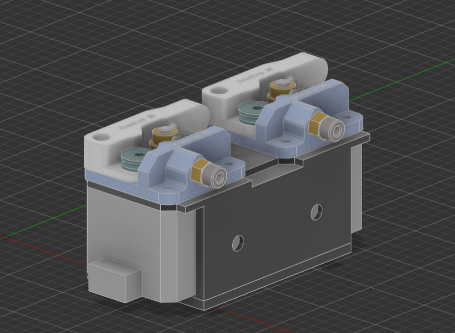
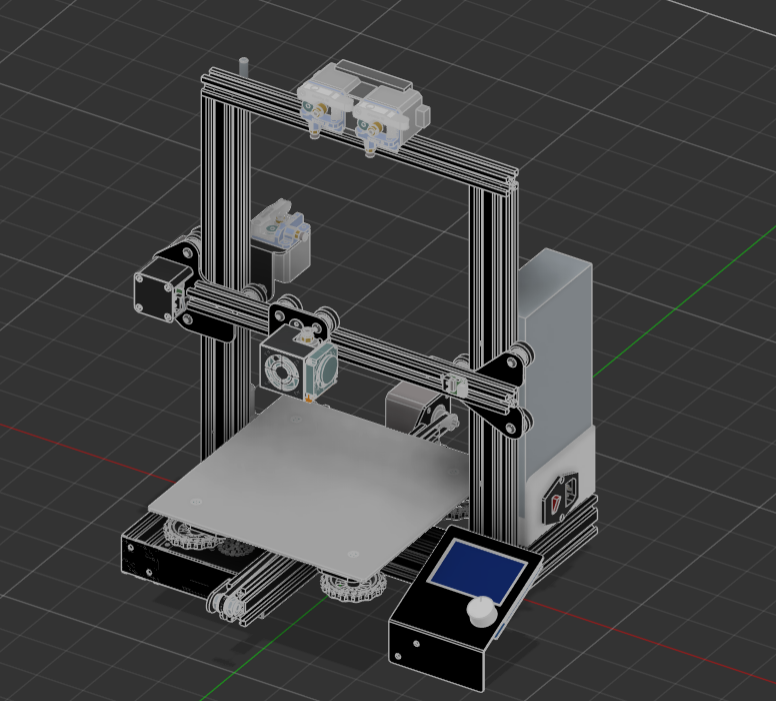
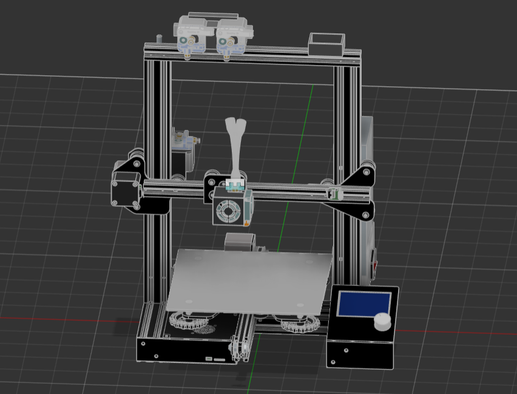

# February 25 8:27: Imported.step files

I started imported the .step file for the printer that this mod will be on.

**Total time spent: 30min**

# February 25 9:49: Made a.step file

I modeled the holder for the stepper motors.

**Total time spent: 2hours**

# February 25 10:55: Imported.step files

I combined the 2 .step files.

**Total time spent: 1hour**

# February 25 12:02: Combined.step files

I combined the all .step files.

**Total time spent: 1hour**

